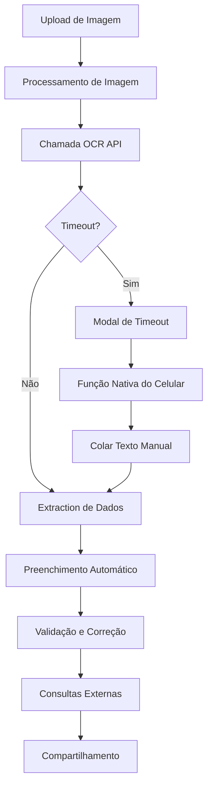

# 🛡️ Doc2Text - Sistema de Reconhecimento de Documentos

<div align="center">


**Sistema inteligente de OCR para extração e processamento de dados de documentos policiais**

[🚀 Demo ao Vivo](https://doc2text.vercel.app) • [📖 Documentação](#documentação) • [🐛 Reportar Bug](https://github.com/Ald3b4r4n/React2Text/issues)

</div>

---

## 📋 Índice

- [Sobre o Projeto](#sobre-o-projeto)
- [Funcionalidades](#funcionalidades)
- [Tecnologias](#tecnologias)
- [Instalação](#instalação)
- [Como Usar](#como-usar)
- [API e Integrações](#api-e-integrações)
- [Arquitetura](#arquitetura)
- [Contribuição](#contribuição)
- [Licença](#licença)

---

## 🎯 Sobre o Projeto

O **Doc2Text** é uma aplicação web desenvolvida especificamente para profissionais de segurança pública, permitindo a extração automatizada de dados de documentos de identificação através de tecnologia OCR (Optical Character Recognition).

### ✨ Principais Benefícios

- **⚡ Processamento Rápido**: Extração de dados em segundos
- **🎯 Precisão Alta**: Algoritmos otimizados para documentos brasileiros
- **📱 Interface Responsiva**: Funciona perfeitamente em dispositivos móveis
- **🔄 Fallback Inteligente**: Alternativas quando o servidor OCR está indisponível
- **🔗 Integração Externa**: Conexão direta com BNMP e consultas de placas

---

## 🚀 Funcionalidades

### 📄 Extração de Dados
- **Nome completo** do abordado
- **Naturalidade** e local de nascimento
- **Nome da genitora/mãe**
- **CPF** com validação de formato
- **Data de nascimento**
- **Antecedentes criminais**
- **Endereço completo**

### 🚗 Dados Veiculares
- **Detecção automática** de placas de veículos
- **Cor e modelo** do veículo
- **Consulta direta** no sistema de placas

### 🔗 Integrações
- **BNMP** (Banco Nacional de Mandados de Prisão)
- **Consulta de Placas** (Portal SSP)
- **WhatsApp** para compartilhamento de dados

### 🛡️ Recursos de Segurança
- **Timeout inteligente** (10 segundos)
- **Modal informativo** quando servidor OCR está fora do ar
- **Instruções alternativas** para função nativa do celular
- **Validação de formulários**

---

## 🛠️ Tecnologias

### Frontend
- **React 18.2.0** - Biblioteca principal
- **Vite 4.4.5** - Build tool e dev server
- **Tailwind CSS 3.3.0** - Framework CSS
- **JavaScript ES6+** - Linguagem principal

### APIs e Serviços
- **OCR.space API** - Reconhecimento óptico de caracteres
- **BNMP Portal** - Consulta de mandados de prisão
- **SSP Portal** - Consulta de veículos

### Ferramentas de Desenvolvimento
- **ESLint** - Linting de código
- **Prettier** - Formatação de código
- **Service Worker** - Cache e PWA

---

## ⚙️ Instalação

### Pré-requisitos
- Node.js 16.0 ou superior
- npm ou yarn
- Git

### Passo a Passo

1. **Clone o repositório**
```bash
git clone https://github.com/Ald3b4r4n/React2Text.git
cd React2Text/react2text
```

2. **Instale as dependências**
```bash
npm install
```

3. **Execute o projeto**
```bash
npm run dev
```

4. **Acesse a aplicação**
```
http://localhost:5173
```

### Scripts Disponíveis

```bash
npm run dev      # Servidor de desenvolvimento
npm run build    # Build de produção
npm run preview  # Preview do build
npm run lint     # Verificação de código
```

---

## 📖 Como Usar

### 1. 📸 Captura do Documento
- **Tirar Foto**: Use a câmera do dispositivo
- **Galeria**: Selecione uma imagem existente
- **Cole Texto**: Cole manualmente o texto extraído

### 2. 🔄 Processamento Automático
- O sistema processa a imagem automaticamente
- Extrai dados usando algoritmos inteligentes
- Preenche os campos do formulário

### 3. ✏️ Correção e Validação
- **Botão "Corrigir"**: Edite campos automaticamente preenchidos
- **Modal de Correção**: Interface amigável para edição
- **Validação**: Verificação automática de formatos

### 4. 🔍 Consultas Externas
- **BNMP**: Consulta mandados de prisão
- **Placas**: Verifica dados do veículo
- **WhatsApp**: Compartilha dados formatados

### 5. 📱 Fallback Inteligente
Quando o servidor OCR está indisponível:
1. Modal informativo aparece automaticamente
2. Instruções para usar função nativa do celular
3. Google Lens, Microsoft Lens ou similar
4. Cole o texto extraído manualmente

---

## 🔌 API e Integrações

### OCR.space API
```javascript
// Configuração automática
const OCR_API_KEY = "K82112819888957";
const OCR_TIMEOUT = 10000; // 10 segundos
```

### Endpoints Utilizados
- **BNMP**: `https://portalbnmp.cnj.jus.br/#/pesquisa-peca`
- **SSP**: `https://mportal.ssp.go.gov.br/`
- **OCR**: `https://api.ocr.space/parse/image`

### Timeout e Fallback
```javascript
// Sistema de timeout inteligente
const timeoutPromise = new Promise((_, reject) => {
  setTimeout(() => {
    reject(new Error("OCR demorou muito tempo para responder"));
  }, OCR_TIMEOUT);
});
```

---

## 🏗️ Arquitetura

### Estrutura de Componentes

```
src/
├── components/
│   ├── ApproachData.jsx          # Formulário principal
│   ├── DocumentAnalysis.jsx      # Upload e processamento
│   ├── PhotoSection.jsx          # Foto do abordado
│   ├── ActionsSection.jsx        # Ações finais
│   └── Modals/
│       ├── CorrectionModal.jsx   # Edição de campos
│       ├── ServerTimeoutModal.jsx # Modal de timeout
│       ├── TutorialModal.jsx     # Tutorial
│       └── WhatsAppInstructionsModal.jsx
├── hooks/
│   ├── useFormData.js           # Gerenciamento de estado
│   ├── useOcr.js                # Lógica de OCR
│   └── useImageProcessing.js    # Processamento de imagens
├── utils/
│   ├── dataExtraction.js        # Extração de dados
│   ├── imageProcessing.js       # Processamento de imagens
│   └── ocr.js                   # Utilitários OCR
└── styles/
    └── Responsive.css           # Estilos responsivos
```

### Fluxo de Dados



### Hooks Customizados

#### `useOcr`
```javascript
const {
  processDocument,      // Processa documento
  processPastedText,    // Processa texto colado
  isProcessing,         // Estado de processamento
  processingProgress    // Progresso do processamento
} = useOcr(currentFile, updateField, setOcrRawText, onTimeout);
```

#### `useFormData`
```javascript
const {
  formData,            // Dados do formulário
  updateField,         // Atualiza campo específico
  resetField,          // Reseta campo específico
  validateForm,        // Valida formulário completo
  isFormValid          // Verifica se formulário é válido
} = useFormData();
```

---

## 🎨 Interface e UX

### Design Responsivo
- **Mobile First**: Otimizado para dispositivos móveis
- **Breakpoints**: sm (640px), md (768px), lg (1024px)
- **Flexbox/Grid**: Layout moderno e flexível

### Componentes Visuais
- **Cards**: Interface limpa e organizada
- **Modals**: Interações sem perder contexto
- **Toast**: Notificações não intrusivas
- **Progress Bar**: Feedback visual do processamento

### Acessibilidade
- **Contraste**: Cores com boa legibilidade
- **Foco**: Indicadores visuais claros
- **Responsividade**: Funciona em todos os dispositivos

---

## 🔧 Configuração Avançada

### Variáveis de Ambiente
```env
VITE_OCR_API_KEY=your_api_key_here
VITE_APP_NAME=Doc2Text
VITE_APP_VERSION=1.0.0
```

### Personalização de Estilos
```css
/* Tailwind CSS customizado */
:root {
  --primary-color: #1e40af;
  --secondary-color: #79bbff;
  --success-color: #10b981;
  --warning-color: #f59e0b;
  --error-color: #ef4444;
}
```

### Service Worker
```javascript
// Cache automático para PWA
if ('serviceWorker' in navigator) {
  navigator.serviceWorker.register('/sw.js');
}
```

---

## 🚀 Deploy

### Vercel (Recomendado)
```bash
npm run build
vercel --prod
```

### Netlify
```bash
npm run build
netlify deploy --prod --dir=dist
```

### Build Manual
```bash
npm run build
# Arquivos em /dist
```

---

## 🧪 Testes

### Testes Manuais
1. **Upload de Imagem**: Teste com diferentes formatos
2. **Timeout**: Simule servidor lento
3. **Responsividade**: Teste em diferentes dispositivos
4. **Integrações**: Verifique links externos

### Casos de Teste
- ✅ Documento com placa de veículo
- ✅ Documento sem placa
- ✅ Imagem de baixa qualidade
- ✅ Timeout do servidor OCR
- ✅ Formulário incompleto

---

## 🤝 Contribuição

### Como Contribuir
1. **Fork** o projeto
2. **Crie** uma branch para sua feature (`git checkout -b feature/AmazingFeature`)
3. **Commit** suas mudanças (`git commit -m 'Add some AmazingFeature'`)
4. **Push** para a branch (`git push origin feature/AmazingFeature`)
5. **Abra** um Pull Request

### Padrões de Código
- **ESLint**: Configuração padrão do projeto
- **Prettier**: Formatação automática
- **Conventional Commits**: Mensagens de commit padronizadas
- **JSDoc**: Documentação de funções

### Reportar Bugs
Use o [sistema de issues](https://github.com/Ald3b4r4n/React2Text/issues) para:
- 🐛 **Bug Reports**
- 💡 **Feature Requests**
- 📖 **Documentation**
- ❓ **Questions**

---

## 📞 Suporte

### Contato
- **WhatsApp**: [Fale conosco](https://wa.me/5561982887294)
- **Email**: [contato@doc2text.com](mailto:contato@doc2text.com)
- **Issues**: [GitHub Issues](https://github.com/Ald3b4r4n/React2Text/issues)

### FAQ

**Q: O OCR não está funcionando?**
A: Use a função nativa do seu celular (Google Lens, etc.) e cole o texto manualmente.

**Q: Posso usar em dispositivos móveis?**
A: Sim! O sistema é totalmente responsivo e otimizado para mobile.

**Q: Os dados são armazenados?**
A: Não, todos os dados são processados localmente no seu dispositivo.

---

## 📄 Licença

Este projeto está licenciado sob a Licença MIT - veja o arquivo [LICENSE](LICENSE) para detalhes.

```
MIT License

Copyright (c) 2024 Doc2Text

Permission is hereby granted, free of charge, to any person obtaining a copy
of this software and associated documentation files (the "Software"), to deal
in the Software without restriction, including without limitation the rights
to use, copy, modify, merge, publish, distribute, sublicense, and/or sell
copies of the Software, and to permit persons to whom the Software is
furnished to do so, subject to the following conditions:

The above copyright notice and this permission notice shall be included in all
copies or substantial portions of the Software.
```

---

## 🙏 Agradecimentos

- **CB Antônio Rafael** - Desenvolvimento e manutenção
- **Comunidade React** - Framework e bibliotecas
- **OCR.space** - API de reconhecimento óptico
- **Tailwind CSS** - Framework de estilos
- **Vercel** - Hospedagem e deploy

---

<div align="center">

**Desenvolvido com ❤️ para profissionais de segurança pública**

[⬆ Voltar ao topo](#-doc2text---sistema-de-reconhecimento-de-documentos)

</div>
